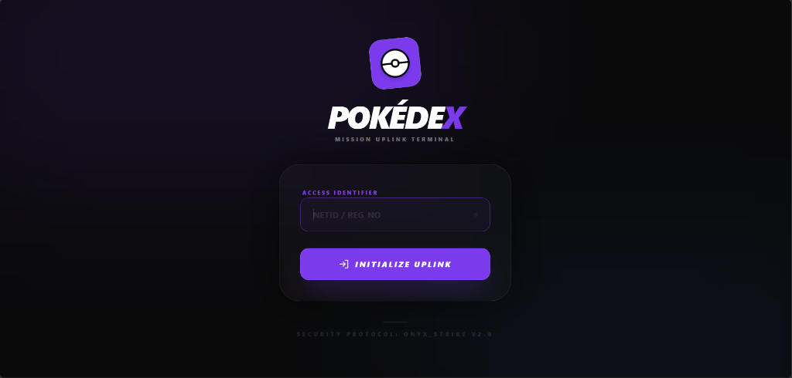
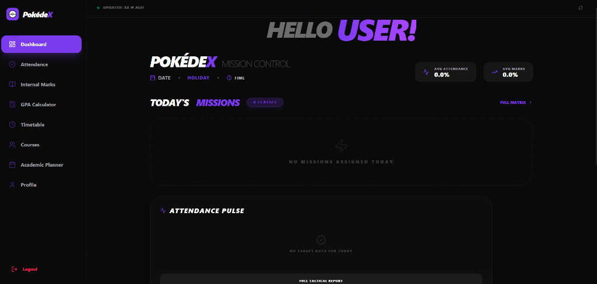

# 🔴 PokédeX: Advanced Academic Mission Control

**PokédeX** is a high-fidelity, tactical academic portal designed for students who demand precision intelligence. It's not just a dashboard; it's your mission control for university life. Built with a "Security-First" mindset and a premium glassmorphic aesthetic.

---

## 🖥️ Interface Matrix

  
<strong>MISSION UPLINK TERMINAL (LOGIN)</strong>

  
    
  
<strong>MISSION CONTROL (DASHBOARD)</strong>

  

---

## 🚀 Key Operations

### 🛰️ Targeted Intelligence Extraction
A multi-tier scraping engine that performs secure handshakes with the SRM Academia portal to retrieve real-time data:
- **Attendance Pulse**: Real-time monitoring of attendance metrics with "Mission Matrix" views.
- **Marks Intelligence**: Deep-dive into internal assessments and course performance analytics.
- **Timetable Matrix**: Live synchronization of your daily schedule and day-order alignment.
- **Academic Planner**: Long-term mission planning with centralized academic telemetry.
- **GPA Calculator**: Precision module for projecting academic performance and grade targets.
- **Profile Recon**: Automated retrieval of faculty advisors, department details, and contact info.

### 🛡️ Onyx-Strike Security Protocol
- **Mission Uplink Terminal**: A custom-built, secure entry point with multi-stage verification.
- **Session Guard**: Intelligent detection of concurrent login limits with manual termination triggers.
- **Encrypted Handshake**: Sanitized data fetching to ensure maximum privacy and integrity.

---

## 🖥️ Operational Status

- **Live Telemetry**: Real-time "Last Updated" timestamps for data synchronization.
- **Authenticated Access**: Secure session management with high-speed token persistence.
- **Dynamic Navigation**: Sidebar-driven modular access to all academic sectors.

---

## 🚀 Deployment (Vercel)

1. **Push to GitHub**: Ensure your repository is private.
2. **Import to Vercel**: Connect your repository to Vercel.
3. **Environment Variables**: Add `NEXT_PUBLIC_SUPABASE_URL` and `NEXT_PUBLIC_SUPABASE_ANON_KEY` if applicable.
4. **Build**: Vercel will automatically detect Next.js and deploy the mission control terminal.

---

## 🛠️ Tech Stack

- **Core**: [Next.js 16 (App Router)](https://nextjs.org/)
- **Intelligence**: [Cheerio](https://cheerio.js.org/) & [Node HTML Parser](https://github.com/vladimirsabev/node-html-parser)
- **Styling**: Tailwind CSS v4 (Glassmorphism & Tactical UI)
- **State**: [Zustand](https://zustand-demo.pmnd.rs/)
- **Icons**: [Lucide React](https://lucide.dev/)
- **Persistence**: Cookies & Supabase

---

## 🎨 Design Philosophy

PokédeX utilizes the **ONYX_STRIKE** design system:
- **Glassmorphism**: High-blur backdrops with subtle border highlights.
- **Micro-animations**: Scanning lights, pulse effects, and smooth transitions.
- **Tactical Aesthetic**: Deep blacks, vibrant primary accents, and monospace telemetry fonts.

---

  <i>"Precision is not an option. It's a requirement."</i>
   
  <strong>[ PRIVATE MISSION CONTROL — AUTHORIZED ACCESS ONLY ]</strong>

